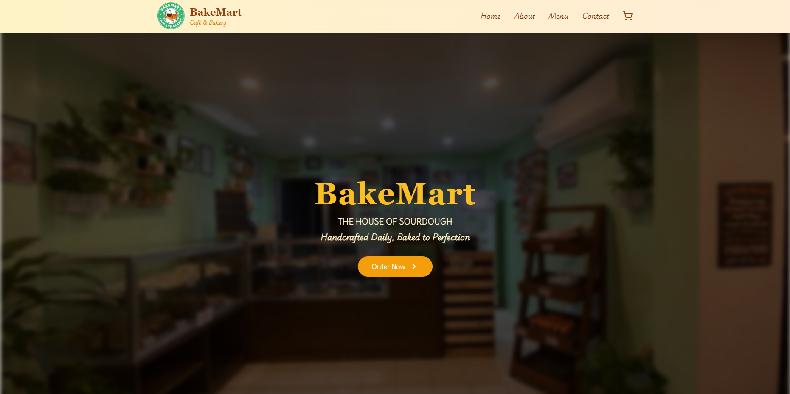
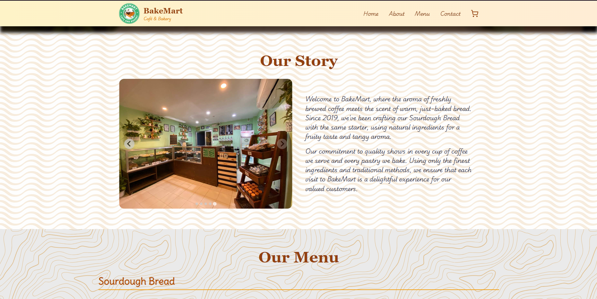
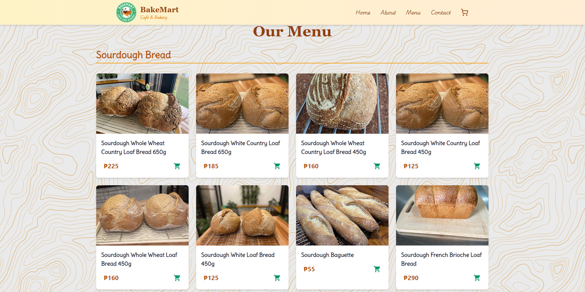
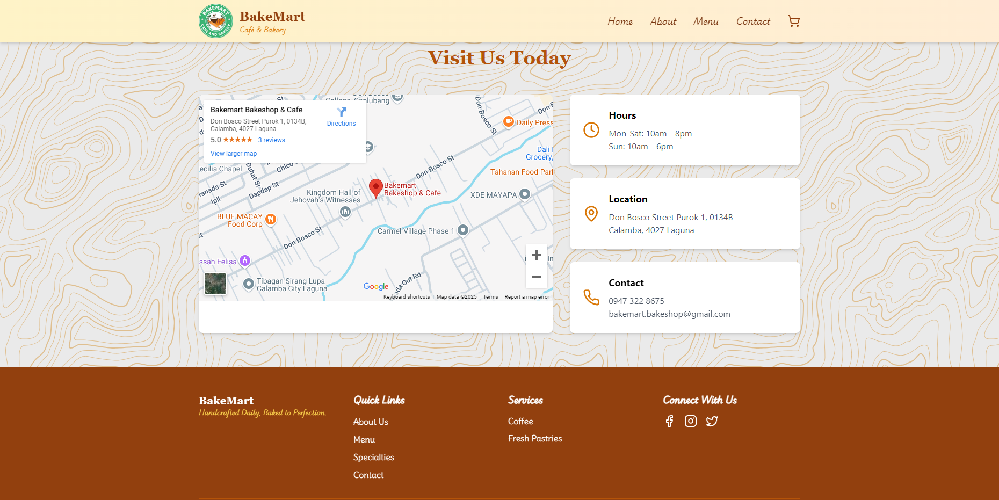

# Bakemart - Cafe & Bakery

## Project Overview

**Bakemart - Cafe & Bakery** is a visually appealing, interactive website designed for a bakery. The website serves as an online menu and information portal for a cafe and bakery business. It showcases a variety of bakery products, with detailed descriptions, prices, and high-quality images. In addition, it provides essential features like location details, contact information, and an online ordering system for a seamless customer experience.

## Features

- **Responsive Design**: Fully responsive, providing a smooth experience across desktop, tablet, and mobile devices.
- **Product Showcase**: Displays various bakery items with their descriptions, images, and prices.
- **Smooth Navigation**: Clean and simple navigation to easily browse products and services.
- **Online Ordering**: Users can add bakery items to their cart for easy online ordering.
- **Contact Information**: Includes contact details such as phone numbers, address, and links to social media accounts.
- **About Us**: Learn more about the cafe's history, vision, and values.

## Technologies Used

- **React**: Component-based architecture used to create a maintainable and scalable website.
- **Tailwind CSS**: Utility-first CSS framework to quickly build custom designs.

## Overview

